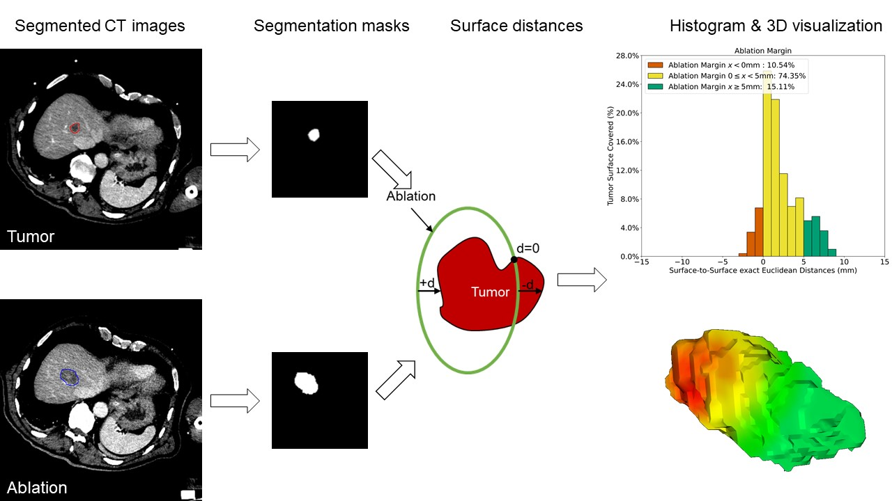

# Quantitative Ablation Margin (QAM)
Library to compute 3D surface-distances between a tumor and an ablation volume.

You can find more about ablation treatments for liver cancer in the following open access book chapter ["Stereotactic Image-Guidance for Ablation of Malignant Liver Tumors"](https://www.intechopen.com/online-first/stereotactic-image-guidance-for-ablation-of-malignant-liver-tumors) from Liver Pathology.

We used an adapted Dice Soerensen coefficient to evaluate the ablation completeness in treating liver tumors. The quantitative ablation margin (QAM) calculation is illustrated  in the next figure. The output is an array of 3D surface distances that can also be visualized as traffic-light colored histogram (see last step in the pipeline).

## Installation

The library can be installed via pip from the GitHub repository

    python -m pip install https://github.com/artorg-unibe-ch/qam.git

## Usage
Import the packages

    from qam import margin, plotting, visualization

To calculate the ablation margin one needs a segmentation mask of the tumor, ablation, and (optional) liver. All images need to be in the same spacing, and co-registered.

    calc_margin.py -t tumor_file -a ablation_file -l liver_file -o output_filename -p patient_id

To plot the margin as a histogram:

    non_ablated, insuffiecient_ablated, completely_ablated =\
    plotting.plot_histogram_surface_distances(pat_name=patient_id, lesion_id=lesion_id,
                                                output_file=output_file_png,
                                                distance_map=surface_distance['distances_gt_to_pred'],
                                                title='Quantitative Ablation Margin',
                                                print_case_details=True')

To visualize the margin in 3D, the NIFTI files can be passed directly:

    visualization.visualize_3d_margin(tumor_nii, ablation_nii, output_file_wrl)
    

